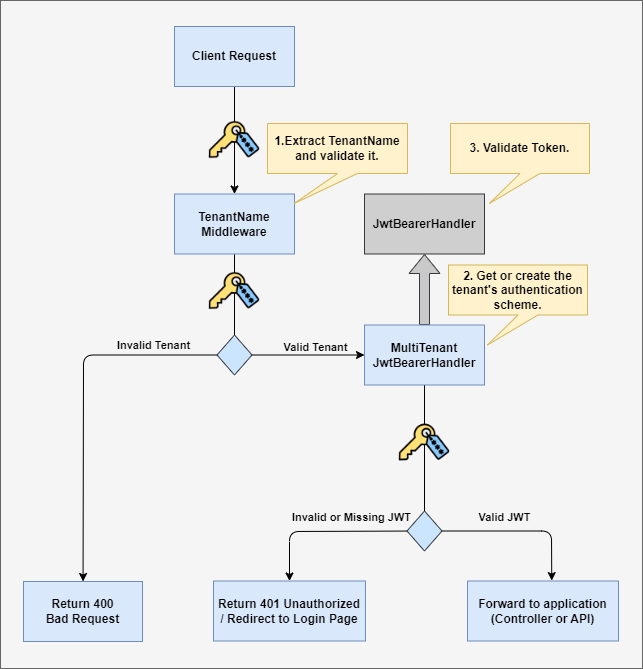

# MultiTenantJwtBearer

## Overview

`MultiTenantJwtBearer` is a dynamic extension for ASP.NET Core applications that simplifies JWT-based multi-tenant authentication. It allows you to authenticate requests in multi-tenant environments without preloading all tenant configurations or restarting the application when new tenants are added.

## Key Features

- **Multi-Tenant JWT Validation:** Streamlines JWT token validation across multiple tenants, identified by URL, in ASP.NET Core APIs.
- **Minimal Code Changes:** Leverages the existing `AddJwtBearer()` method, requiring minimal adjustments for multi-tenant support.
- **Future-Proof:** Designed for compatibility with updates to core dependencies, ensuring long-term viability.

## How It Works

The key to **MultiTenantJwtBearer** is its ability to extend the existing `JwtBearerHandler`. The new handler, `MultiTenantJwtBearerHandler`, inherits from `JwtBearerHandler` and adds multi-tenant support while retaining backward compatibility.

With the solution in place, here's how the authentication flow works in practice:


**<p align="center">Authentication Flow</p>**

**1- Extract Tenant Name:** The `TenantNameMiddleware` extracts the tenant name from the request (e.g., subdomain, URL path, or header) and validates it. Invalid tenant names result in a 400 Bad Request.

**2- Dynamic Scheme Creation:** The `MultiTenantJwtBearerHandler` dynamically creates and manages authentication schemes based on the extracted tenant name. If a scheme exists, it is retrieved from the cache; otherwise, a new scheme is created at runtime.

**3- JWT Validation:** The `JwtBearerHandler` validates the JWT token using the tenant's configuration. Valid tokens allow the request to proceed; invalid tokens result in a 401 Unauthorized.

## Getting Started
- **Set the default authentication scheme**
Setting `JwtBearerDefaults.AuthenticationScheme` as the default scheme is crucial for the solution to work correctly. It ensures that the authentication and challenge flows function as expected.

```csharp
var mainSchemeHandler = JwtBearerDefaults.AuthenticationScheme;
builder.Services
    .AddAuthentication(options =>
    {
        options.DefaultAuthenticateScheme = mainSchemeHandler;
        options.DefaultChallengeScheme = mainSchemeHandler;
        options.DefaultScheme = mainSchemeHandler;
    });
```

- **Use AddMultiTenantJwtBearer() instead of AddJwtBearer()**
When configuring `AddMultiTenantJwtBearer()`, you must use the same scheme name (mainSchemeHandler) as defined in `AddAuthentication()`.

```csharp
var mainSchemeHandler = JwtBearerDefaults.AuthenticationScheme;
builder.Services
    .AddAuthentication(options =>
    {
        options.DefaultAuthenticateScheme = mainSchemeHandler;
        options.DefaultChallengeScheme = mainSchemeHandler;
        options.DefaultScheme = mainSchemeHandler;
    })
    .AddMultiTenantJwtBearer(mainSchemeHandler);
```

If you need to set default options that can be reused by all tenants, you can configure them directly in AddMultiTenantJwtBearer():

```csharp
var mainSchemeHandler = JwtBearerDefaults.AuthenticationScheme;
builder.Services
    .AddAuthentication(options =>
    {
        options.DefaultAuthenticateScheme = mainSchemeHandler;
        options.DefaultChallengeScheme = mainSchemeHandler;
        options.DefaultScheme = mainSchemeHandler;
    })
    .AddMultiTenantJwtBearer(mainSchemeHandler, options =>
    {
        options.RequireHttpsMetadata = false; 
        options.UseSecurityTokenValidators = true; 
        // Add any other default settings here.
    });
```

The `AddMultiTenantJwtBearer()` method replaces the default `JwtBearerHandler` with a custom handler named `MultiTenantJwtBearerHandler`.

- **Manage Tenant Options**
The `EnsureTenantOptions(tenantName)` method is responsible for dynamically loading or creating the required tenant-specific options. This is done using a cache to ensure each tenant's options are initialized only once.

```csharp
private void EnsureTenantOptions(string tenantName)
{
    cache.GetOrAdd(tenantName, () =>
    {
        var options = InitTenantOptions(tenantName);
        PostConfigure(tenantName, options);
        return options;
    });
}

private JwtBearerOptions InitTenantOptions(string tenantName)
{
    var tenantConfiguration = tenantConfigurationService.GetJwtBearerOptions(tenantName);
    return new JwtBearerOptions
    {
        // Set specific configuration.
        Audience = tenantConfiguration.Audience,
        Authority = tenantConfiguration.Authority,
        MetadataAddress = tenantConfiguration.MetadataAddress,
        ClaimsIssuer = tenantConfiguration.ClaimsIssuer,

        // Set common configuration. Depends on your needs, you can move options to ITenantJwtBearerConfigurationService.
        RequireHttpsMetadata = Options.RequireHttpsMetadata,
        UseSecurityTokenValidators = Options.UseSecurityTokenValidators,
    };
}
```

For tenant-specific configurations, you should load the necessary data from an external source, such as a database or a configuration file, through your tenant service for example.
Ensure that these common options previously defined in `AddMultiTenantJwtBearer()` are properly bound to the tenant-specific options.

## Project Status

Currently, `MultiTenantJwtBearer` is in an experimental phase. Users are advised to conduct thorough testing before incorporating this into production environments.

## Feedback and Contributions

Feedback, suggestions, and contributions are highly welcome. If you have any ideas, encounter issues, or want to contribute, please open an issue or submit a pull request. Your input helps make MultiTenantJwtBearer better for everyone.